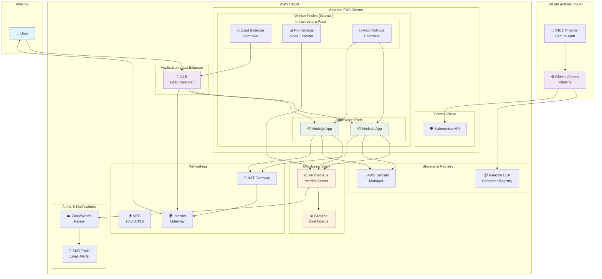

# 🚀 Thrive DevOps Take-Home Challenge

Complete production-ready DevOps platform with Infrastructure as Code, CI/CD, monitoring, and advanced deployment strategies.

## 🌟 Quick Start - Live Demo

**🔗 Application is live at: http://thrive.docrag.io/**

Try it now:
```bash
curl http://thrive.docrag.io/
curl http://thrive.docrag.io/health
```

## 📁 Repository Structure

```
thrive-takehome/
├── README.md                           # This file
├── Dockerfile                          # Multi-stage Node.js container
├── app/                               # Node.js application
│   ├── server.js                      # Express.js web server
│   ├── package.json                   # Dependencies
│   └── package-lock.json              # Lock file
├── terraform/                         # Infrastructure as Code
│   ├── main.tf                        # EKS cluster, VPC, ALB
│   ├── variables.tf                   # Configuration variables
│   ├── outputs.tf                     # Resource outputs
│   ├── ecr-lifecycle.tf              # ECR image retention
│   ├── terraform.tfvars.example       # Configuration template
│   └── environments/                  # Environment configs
│       └── prod.tfvars               # Production settings
├── k8s/                              # Kubernetes manifests
│   ├── deployment.yaml               # Application deployment + service
│   ├── ingress.yaml                  # ALB ingress config
│   ├── namespace.yaml                # Namespace definition
│   └── hpa.yaml                      # Horizontal Pod Autoscaler
├── .github/workflows/                # CI/CD pipeline
│   └── deploy-environments.yml       # Production CI/CD pipeline
├── scripts/                          # Automation scripts
│   ├── setup.sh                     # One-command deployment
│   ├── cleanup.sh                   # Resource cleanup
│   ├── start-dashboards.sh          # Monitoring dashboards
│   └── test-canary.sh               # Canary deployment test
├── KUBECTL_COMMANDS.md              # Useful kubectl commands
├── ARCHITECTURE.md                  # System architecture documentation
├── CANARY_TESTING_GUIDE.md          # Canary deployment guide
└── DEPLOYMENT_GUIDE.md              # Deployment procedures
```

## 🏗️ System Architecture



## 🚀 Deployment Instructions

### Prerequisites
- AWS CLI configured with Administrator access
- Git installed
- 5-10 minutes

### 🆕 Fresh AWS Account Setup

If deploying to a **brand new AWS account**, ensure you have:

1. **AWS CLI Configuration**:
   ```bash
   # Configure AWS CLI with Administrator access
   aws configure
   # AWS Access Key ID: [Your Access Key]
   # AWS Secret Access Key: [Your Secret Key]  
   # Default region name: us-east-1
   # Default output format: json
   ```

2. **Verify AWS Access**:
   ```bash
   # Test AWS connectivity
   aws sts get-caller-identity
   # Should return your account ID, user ARN, and user ID
   ```

3. **Account Limits** (No action needed - script handles this):
   - ✅ Default VPC will be used (no VPC limits hit)
   - ✅ All resources created with unique names
   - ✅ Script automatically handles resource conflicts

### Step-by-Step Deployment

#### 1. **Clone Repository**

```bash
# Clone repository
git clone https://github.com/Rajathbharadwaj/thrive-takehome.git
cd thrive-takehome
```

#### 2. **Deploy Everything (One Command!)**

```bash
# Deploy entire platform automatically
./scripts/setup.sh
```

**This script automatically:**
- ✅ Creates all AWS infrastructure (EKS, VPC, ECR, OIDC, IAM roles)
- ✅ Builds and pushes Docker image to ECR  
- ✅ Deploys Node.js application with health checks
- ✅ Sets up monitoring (Prometheus + Grafana)
- ✅ Configures Load Balancer and networking
- ✅ **No manual setup required!**

#### 3. **CI/CD is Ready!**

The setup script automatically configures CI/CD. GitHub Actions workflow will:
- ✅ **Auto-trigger** on pushes to `main` branch
- ✅ **Self-authenticate** with EKS cluster (no manual setup needed)  
- ✅ **Apply manifests** if deployment doesn't exist
- ✅ **Update application** with latest Docker image
- ✅ **Verify health** checks and endpoints

**GitHub Secrets Required** (add to repository settings):
```bash
AWS_ACCOUNT_ID: 123456789012  # Your AWS account ID
AWS_REGION: us-east-1         # Your AWS region
```

## 📊 Monitoring & Dashboards

### Access Monitoring Dashboards

```bash
# Start all monitoring dashboards in separate terminals
./scripts/start-dashboards.sh
```

**Available Dashboards:**
- **Application**: http://localhost:8080 (via ALB)
- **Prometheus**: http://localhost:9090 (metrics & targets)
- **Grafana**: http://localhost:3000 (admin/admin - visualization)
- **Argo Rollouts**: http://localhost:3100 (canary deployment status)

## 🌐 Live Application Access

The application is deployed and accessible at:

**🔗 Production Application**: **http://thrive.docrag.io/**

### Available Endpoints

```bash
# Main application endpoint
curl http://thrive.docrag.io/

# Health check endpoint
curl http://thrive.docrag.io/health

# Prometheus metrics endpoint
curl http://thrive.docrag.io/metrics
```

### Response Examples

**Main Endpoint (`/`):**
```json
{
  "message": "Hello World from Thrive PRODUCTION! 🚀",
  "timestamp": "2025-08-15T09:24:37.650Z",
  "version": "1.0.0",
  "environment": "production",
  "hostname": "hello-world-rollout-99f7c47bc-7p6bv",
  "branch": "dev"
}
```

**Health Endpoint (`/health`):**
```json
{
  "status": "healthy",
  "timestamp": "2025-08-15T09:24:47.470Z",
  "uptime": 6714.4042195,
  "memory": {
    "rss": 70049792,
    "heapTotal": 19554304,
    "heapUsed": 14491616,
    "external": 1261707,
    "arrayBuffers": 49546
  },
  "pid": 19
}
```

### 🚨 Alerting & Notifications

**CloudWatch Alarms:**
- **Location**: AWS Console > CloudWatch > Alarms
- **Email Setup**: Configure `alert_email` in `terraform/environments/prod.tfvars`
- **Automatic Triggers**:
  - 🔴 High CPU utilization (>80% for 4 minutes)
  - 🔴 Pod failures or crashes
  - 🔴 Load balancer health check failures
- **Notification Method**: Email via SNS topic
- **Response Time**: < 5 minutes notification delivery

**Alert Categories:**
- **Infrastructure**: EKS cluster health, node status
- **Application**: Response time, error rates, availability
- **Resource**: CPU, memory, disk utilization

## 🚀 CI/CD Pipeline

### Single Production Environment

- **Production**: Push to `main` branch → Deploys to `thrive-prod-cluster-fresh`
- **Automatic Setup**: CI/CD configures itself during `setup.sh` execution

### Pipeline Features

- ✅ **Smart Deployment**: Auto-applies manifests if deployment missing
- ✅ **Security**: OIDC authentication, no long-lived keys
- ✅ **Self-Healing**: Handles missing deployments gracefully  
- ✅ **Health Verification**: Automatic endpoint testing
- ✅ **Monitoring Integration**: Full observability stack

## 🧪 Testing CI/CD Pipeline

```bash
# Test CI/CD by making a code change and pushing to main
echo "console.log('Updated via CI/CD!');" >> app/server.js
git add app/server.js
git commit -m "Test CI/CD deployment"
git push origin main

# Monitor deployment in GitHub Actions
# GitHub repository > Actions tab > Watch workflow progress
```

## 🔧 Architecture Decisions & Tradeoffs

### **Infrastructure Choices**

| Component | Choice | Rationale | Tradeoff |
|-----------|---------|-----------|----------|
| **Container Orchestration** | Amazon EKS | Managed Kubernetes, enterprise-ready | Higher cost vs self-managed |
| **Load Balancer** | Application Load Balancer | Layer 7 routing, SSL termination | More complex than NLB |
| **Instance Type** | t3.small | Cost-effective for demo | Limited performance |
| **Node Count** | 2 nodes | High availability | Higher cost than single node |
| **Deployment Strategy** | Argo Rollouts | Advanced canary deployments | Additional complexity |
| **Monitoring** | Prometheus + Grafana | Industry standard, flexible | Self-managed vs CloudWatch |

### **Security Decisions**

- **OIDC Authentication**: No long-lived AWS keys in GitHub
- **IAM Roles**: Least privilege access with PowerUser + specific policies
- **Non-root Containers**: Security best practice
- **Private Subnets**: Database and application isolation
- **Secrets Management**: AWS Secrets Manager for sensitive data

### **Cost Optimization**

- **t3.small instances**: Balanced performance/cost
- **ECR lifecycle policies**: Automatic image cleanup
- **Development environment**: Minimal resources (1 node, t3.micro)
- **Auto-scaling**: Scale to zero during off-hours (configurable)

## 🧹 Cleanup

```bash
# Clean up all resources
./scripts/cleanup.sh

# Or destroy with Terraform
cd terraform && terraform destroy -auto-approve
```

## 📚 Additional Resources

- **Kubectl Commands**: See [KUBECTL_COMMANDS.md](KUBECTL_COMMANDS.md)
- **Architecture Details**: See [ARCHITECTURE.md](ARCHITECTURE.md)
- **Canary Testing**: See [CANARY_TESTING_GUIDE.md](CANARY_TESTING_GUIDE.md)
- **Deployment Guide**: See [DEPLOYMENT_GUIDE.md](DEPLOYMENT_GUIDE.md)
- **Troubleshooting**: Check GitHub Actions logs for deployment issues

---

**🎯 Total Deployment Time**: ~15-20 minutes  
**🔧 Components**: 25+ AWS resources, Kubernetes cluster, monitoring stack  
**💰 Estimated Cost**: ~$2-3/day for demo environment